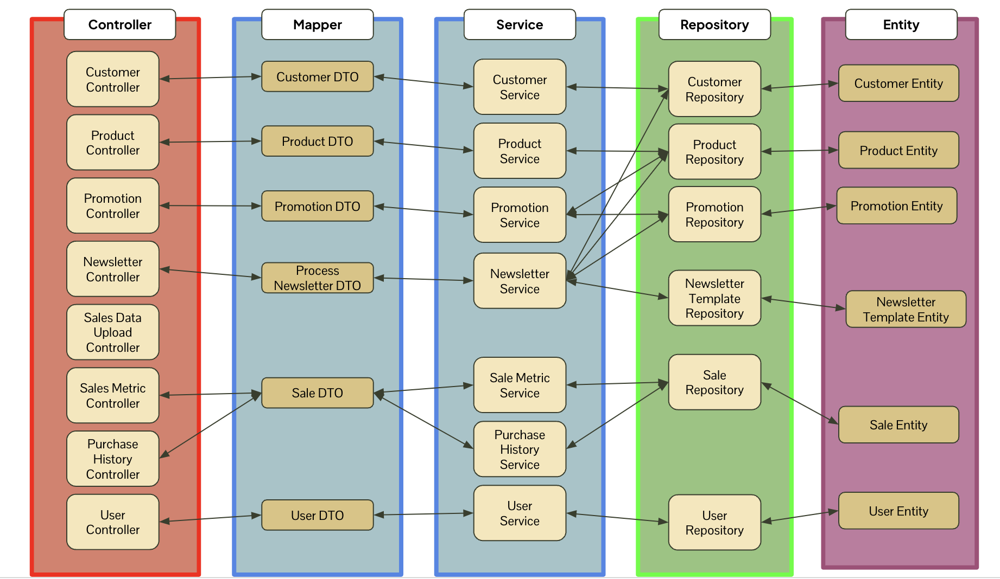

# OOP-G1-4
# 🛠️ Timperio CRM System

A powerful **Customer Relationship Management (CRM)** system developed by **Esther Lam Xuan Yi, Nicholas Tan Zhen Rong**, **Shubasheesh Prakash**, and **Dennis Hardianto** for **[Timperio](https://www.timperio.co/)**. This CRM is designed to enhance customer interaction management, streamline newsletter campaigns, and segment customer data effectively.

---

## 🌟 **Project Overview**

The **Timperio CRM System** offers the following key features:
- 📋 **Customer Data Management**: Effortlessly manage customer data with detailed records.
- ✉️ **Newsletter Campaigns**: Create, edit, and manage dynamic newsletters.
- 📊 **Customer Segmentation**: Leverage **RFM Analysis** (Recency, Frequency, Monetary) for targeted communication.
- 📂 **CSV Import/Export**: Simplify bulk operations with CSV support.
- 🔒 **Secure Authentication**: Employ JWT-based authentication and authorization.

---

### Contributors

- [Esther Lam Xuan Yi](https://github.com/developerlxy)
- [Nicholas Tan Zhen Rong](https://github.com/nicamanas)
- [Shubasheesh Prakash](https://github.com/Shubhash007)
- [Dennis Hardianto](https://github.com/DennisH18)

---

## 🖥️ **Tech Stack**

### Backend (Spring Boot)  
Located in the **`cd-backend/timperio-g1-4`** directory, the backend powers the API, authentication, and business logic.

| **Technology**           | **Purpose**                                               |
|--------------------------|----------------------------------------------------------|
|  | Simplified application configuration.                  |
|  | Time-sensitive tokens for secure authentication.     |
|  | Reduces boilerplate code.                             |
|  | Simplifies handling CSV files for upload/export.      |
|  | Renders HTTP content dynamically for newsletters.     |

---

### Frontend (Vue.js + Vuetify)
Located in the **`cd-frontend`** directory, the frontend provides an interactive, responsive interface.

| **Technology**           | **Purpose**                                               |
|--------------------------|----------------------------------------------------------|
|  | Frontend framework for UI.                           |
|  | Material Design-inspired components.                 |

---

## ⚙️ **Features**

1. **Newsletter Management**  
   - Create, update, and delete newsletters.
   - Live preview for HTML content.

2. **Customer Segmentation**  
   - RFM Analysis (Recency, Frequency, Monetary value).
   - Filter and target specific customer segments.

3. **CSV Import/Export**  
   - Upload customer lists in bulk.  
   - Export campaign data effortlessly.

4. **Secure Access Control**  
   - Role-based access powered by **JWT tokens**.

---

## 🚀 **Getting Started**

### Prerequisites
Ensure the following are installed:
- **Java 17+**
- **Node.js 16+**
- **MySQL** (Database)

---

### Database Setup

1. Ensure that MySQL is installed on your system.
2. Start the MySQL service using your preferred method. For example:


    ```
    sudo service mysql start
    ```
    or
    ```
    systemctl start mysql
    ```

3. Log in to MySQL with your credentials:
    ```
    mysql -u root -p
    ```
4. Create a new database named timperio:
    ```
    CREATE DATABASE timperio;
    ```

---

### Backend Setup

1. Navigate to the `cd-backend/timperio-g1-4` directory.
2. Configure environment variables in the `.env` file:
   ```env
   JWT_SECRET=your_jwt_secret
   MAIL_USERNAME=your_email_address
   MAIL_PASSWORD=your_email_password
    ```

---
    
### Frontend Setup

1. Navigate to the `cd-frontend` directory.
2. Install dependencies:

   ```
   npm install
   ```
3. Run the development server:

    ```
   npm run dev
   ```

## **Project Structure**

The project is organized into **backend** and **frontend** directories:

```plaintext
OOP-G1-4/
├── backend/
│   ├── database/                   # Database setup and configurations
│   ├── timperio-g1-4/              # Spring Boot backend
│   │   ├── .mvn/                   # Maven wrapper
│   │   ├── src/                    # Source code
│   │   │   ├── main/
│   │   │   │   ├── java/com/example/timperio_g1_4/
│   │   │   │   │   ├── config/     # Security and application configurations
│   │   │   │   │   ├── controller/ # REST controllers for APIs
│   │   │   │   │   ├── dto/        # Data Transfer Objects
│   │   │   │   │   ├── entity/     # JPA entities
│   │   │   │   │   ├── enums/      # Enums for various constants
│   │   │   │   │   ├── filter/     # Filters for request/response handling
│   │   │   │   │   ├── mapper/     # Entity to DTO mapping
│   │   │   │   │   ├── repository/ # JPA repositories
│   │   │   │   │   ├── service/    # Business logic and services
│   │   │   │   ├── resources/      # Application resources (e.g., `application.properties`)
│   │   │   ├── test/               # Unit and integration tests
│   │   ├── .env                    # Environment variables
│   │   ├── mvnw                    # Maven wrapper
│   │   └── mvnw.cmd
├── frontend/
│   ├── .vite/                      # Vite configuration for Vue.js
│   ├── dist/                       # Production build files
│   ├── src/                        # Vue.js source code
│   ├── node_modules/               # Node.js dependencies
│   └── package.json                # Frontend package configurations

```

## **System Architecture**




## **UML Diagram**

Link to UML: https://lucid.app/lucidchart/fbe38dd5-0e01-43fc-ab7c-4e7624f34e14/edit?viewport_loc=-2048%2C-4791%2C5694%2C4402%2CHWEp-vi-RSFO&invitationId=inv_5b9ba8e5-678d-4c75-9ce6-29f999ac1735
